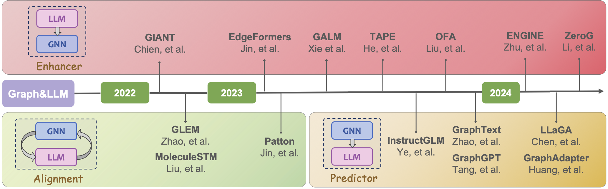

<h1 align="center"> GLBench: A Comprehensive Benchmark for Graphs with Large Language Models </a></h2>
<h5 align="center"> If you like our project, please give us a star ⭐ on GitHub for the latest update.</h5>

<h5 align="center">

    

</h5>

This is the official implementation of the following paper: 
> **GLBench: A Comprehensive Benchmark for Graphs with Large Language Models**
> 
> Yuhan Li, Peisong Wang, Xiao Zhu, Aochuan Chen, Haiyun Jiang, Deng Cai, Victor Wai Kin Chan, Jia Li


<p align="center"></p>
<p align="center"><em>Trend of Graph&LLM.</em></p>

# Environment Setup
Before you begin, ensure that you have Anaconda or Miniconda installed on your system. This guide assumes that you have a CUDA-enabled GPU.
After create your conda environment (we recommend python==3.10), please run 
```
pip install -r requirements.txt
```
to install python packages.

# Datasets
All datasets in GLBench are available in this [link](https://drive.google.com/drive/folders/1WfBIPA3dMd8qQZ6QlQRg9MIFGMwnPdFj?usp=drive_link).
Please place them in the ```datasets``` folder.

# Benchmarking
## Supervised

### Classical(GNN)
Benchmark the Classical GNNs (grid-search hyperparameters)
```
cd models/gnn
bash models/gnn/run.sh
```
### LLM
Benchmark the LLMs(Sent-BERT, BERT, RoBERTa)
```
cd models/llm
bash 
```

### Enhancer
- GIANT

> Due to some package conflicts or version limitations, we recommend using docker to run GIANT. The docker file is in
```
models/enhancer/giant-xrt/dockerfile
```
> After starting the Docker container, run
```
cd models/enhancer/giant-xrt/
bash run_all.sh
```
- TAPE
```
cd models/enhancer/TAPE/
bash run.sh
```
- OFA
```
cd models/enhancer/OneForAll/
bash run.sh
```
- ENGINE
### Predictor

- InstructGLM

- GraphText

> Due to some package conflicts or version limitations, we recommend using docker to run GraphText. The docker file is in
```
models/predictor/GraphText/dockerfile
```
> After starting the Docker container, run
```
cd models/predictor/GraphText
bash run.sh
```

- GraphAdapter
```
cd models/predictor/GraphAdapter
bash run.sh
```
- LLaGA

## Aignment
- GLEM
```
cd models/alignment/GLEM
bash run.sh
```
- Patton
```
bash run_pretrain.sh
bash nc_class_train.sh
bash nc_class_test.sh
```
> We also provide seperate scripts for different datasets.
- Zero-shot
## LLM
Benchmark the LLMs(LLaMA3, GPT-3.5-turbo, GPT-4o, DeepSeek-chat)
```
cd models/llm
```
You can use your own API key for OpenAI.

## Enhancer
- OFA
```
cd models/enhancer/OneForAll/
bash run_zeroshot.sh
```
- ZeroG
## Predictor
- GraphGPT
```
cd models/predictor/GraphGPT
bash ./scripts/eval_script/graphgpt_eval.sh
```
## FYI: our other works

<p align="center"><em>🔥 <strong>A Survey of Graph Meets Large Language Model: Progress and Future Directions (IJCAI'24) </strong></em></p>
<p align="center"><em><a href="https://github.com/yhLeeee/Awesome-LLMs-in-Graph-tasks">Github Repo</a> | <a href="https://arxiv.org/abs/2311.12399">Paper</a></em></p>

## Acknowledgement
We are appreciated to all authors of works we cite for their solid work and clear code organization!

## Code Base Structure
```
$CODE_DIR
    ├── datasets
    └── models
        ├── alignment
        │   ├── GLEM
        │   └── Patton
        ├── enhancer
        │   ├── ENGINE
        │   ├── giant-xrt
        │   ├── OneForAll
        │   └── TAPE
        ├── gnn
        ├── llm
        │   ├── deepseek-chat
        │   ├── gpt-3.5-turbo
        │   ├── gpt-4o
        │   └── llama3-70b
        └── predictor
           ├── GraphAdapter
           ├── GraphGPT
           ├── GraphText
           ├── InstructGLM
           └── LLaGA
```