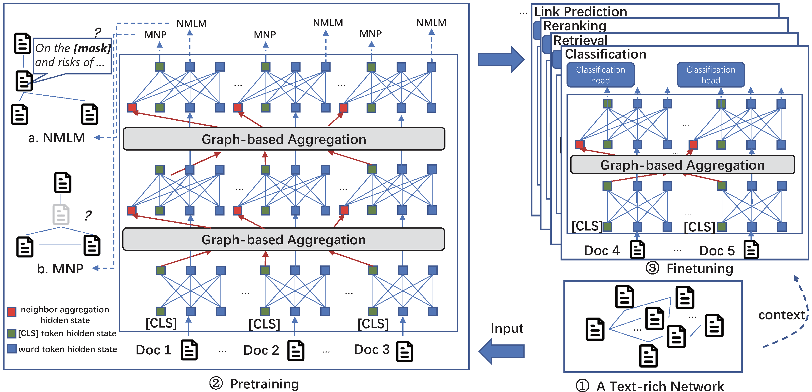

<!-- # Patton: Language Model Pretraining on Text-rich Networks -->
# Patton 

This repository contains the source code and datasets for [Patton: Language Model Pretraining on Text-rich Networks](https://aclanthology.org/2023.acl-long.387.pdf), published in ACL 2023.

## Links

- [Requirements](#requirements)
- [Overview](#overview)
- [Datasets](#datasets)
- [Pretraining Patton](#pretraining-patton)
- [Finetuning Patton](#finetuning-patton)
- [Citations](#citations)

## Requirements

The code is written in Python 3.8. Before running, you need to first install the required packages by typing following commands (Using a virtual environment is recommended):

```
pip3 install -r requirements.txt
```

## Overview
**Patton** is a framework to pretrain language models on text-rich networks, with two strategies: network-contextualized masked language modeling and masked node prediction.

<p align="center">
  
</p>

## Datasets
**Download processed data.** To reproduce the results in our paper, you need to first download the processed [datasets](https://drive.google.com/drive/folders/1k0ISi6-vBwUQOioNMkHYe8cu-pzlg-3T?usp=sharing). The extract the data files by
```
tar -xf data.tar.gz
```

Create a new ```ckpt/``` folder for checkpoint saving and a new ```logs/``` folder for logs saving.
```
mkdir ckpt
mkdir logs
```

**Raw data & data processing.** Raw data can be downloaded from [MAG](https://zenodo.org/record/7611544) and [Amazon](http://jmcauley.ucsd.edu/data/amazon/links.html) directly. You can also find our data processing codes [here](https://github.com/PeterGriffinJin/Patton/tree/main/data_process). They might be useful if you want to obtain processed dataset (both for pretrain and finetune) for other networks in [MAG](https://zenodo.org/record/7611544) and [Amazon](http://jmcauley.ucsd.edu/data/amazon/links.html).

**Use your own dataset.** To pretrain Patton on your own data, you need to prepare the pretraining files: train.tsv, val.tsv, test.tsv. In the three files, each row represents a linked node pair:
```
{
  "q_text": (str) node_1 associated text,
  "k_text": (str) node_2 associated text,
  "q_n_text": (List(str)) node_1 neighbors' associated text,
  "k_n_text": (List(str)) node_2 neighbors' associated text,
}
```
Please refer to the file in our processed dataset for their detailed format information.

We also provide pre-tokenization code [here](https://github.com/PeterGriffinJin/Patton/blob/main/src/scripts/build_train.sh) to improve pretraining/finetuning efficiency.


## Pretraining Patton
Pretraining Patton starting from bert-base-uncased.
```
bash run_pretrain.sh
```
Pretraining SciPatton starting from scibert-base-uncased.
```
bash run_pretrain_sci.sh
```

Change ```$PROJ_DIR``` to your project directory. We support both single GPU training and multi-GPU training.

You can directly download our pretrained checkpoints [here](https://drive.google.com/file/d/1WEgYfgUKfchYrrfqGKmuKfNorBH9pU4H/view?usp=drive_link). Then extract the checkpoint files by
```
tar -xf pretrained_ckpt.tar.gz
```

## Finetuning Patton

### Classification
#### Run classification train.
```
bash nc_class_train.sh
```

#### Run classification test.
```
bash nc_class_test.sh
```
Change ```$STEP``` to the highest validation set performance step.

### Retrieval
Run bm25 to prepare hard negatives.
```
cd bm25/
bash bm25.sh
```

Prepare data for retrieval.
```
cd src/
bash nc_retrieve_gen_bm25neg.sh
bash build_train.sh
```

Run retrieval train.
```
bash nc_retrieve_train.sh
```

Run retrieval test.
```
bash nc_infer.sh
bash nc_retrieval.sh
```

### Reranking
Prepare data for reranking.
```
bash scripts/match.sh
```

Run reranking train.
```
bash nc_rerank_train.sh
```

Run reranking test.
```
bash nc_rerank_test.sh
```

### Link Prediction
Run link prediction train.
```
bash lp_train.sh
```

Run link prediction test.
```
bash lp_test.sh
```

## Citations

Please cite the following paper if you find the code helpful for your research.
```
@inproceedings{jin2023patton,
  title={Patton: Language Model Pretraining on Text-Rich Networks},
  author={Jin, Bowen and Zhang, Wentao and Zhang, Yu and Meng, Yu and Zhang, Xinyang and Zhu, Qi and Han, Jiawei},
  booktitle={Proceedings of the 61st Annual Meeting of the Association for Computational Linguistics},
  year={2023}
}
```

## Acknowledge
Some parts of our code are adapted from the [tevatron](https://github.com/texttron/tevatron) repository. Huge thanks to the contributors of the amazing repository!

## Code base Structure
```
$CODE_DIR
    ├── ckpt
    ├── data
    │   ├── amazon
    │   │   ├── cloth
    │   │   ├── home
    │   │   └── sports
    │   └── MAG
    │       ├── CS
    │       ├── Geology
    │       └── Mathematics
    ├── src
    │   ├── OpenLP
    │   │   ├── __init__.py
    │   │   ├── __pycache__
    │   │   ├── arguments.py
    │   │   ├── dataset
    │   │   ├── driver
    │   │   ├── loss.py
    │   │   ├── models
    │   │   ├── modeling.py
    │   │   ├── retriever
    │   │   ├── trainer
    │   │   └── utils.py
    │   └── scripts
    │       ├── build_train.py
    │       ├── build_train_ncc.py
    │       ├── build_train_neg.py
    │       └── bm25_neg.py
    └── logs
```
